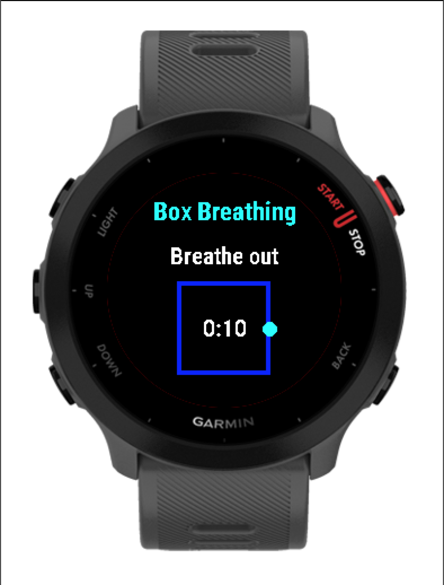
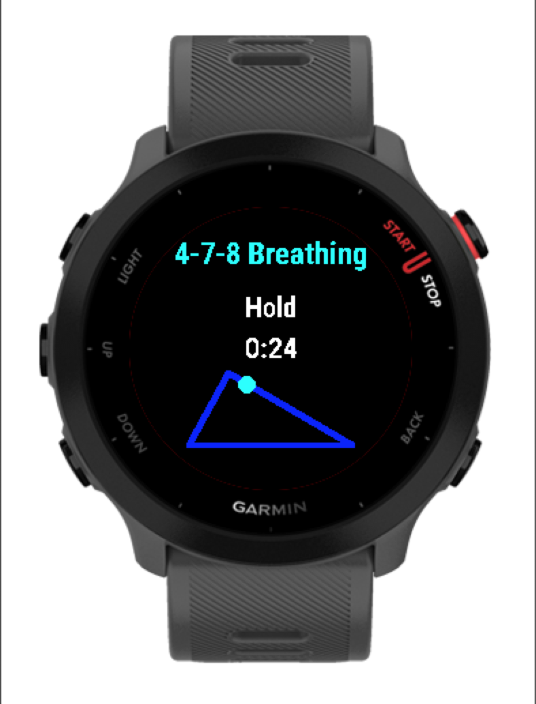

# Garmin Breathing Exercises

This is a Garmin app (specifically developed for the Forerunner 55) that guides you through breathing exercises. At the moment, it has box breathing and 4-7-8 breathing.

You can view the app in the Garmin Connect IQ Store here: https://apps.garmin.com/apps/ab9c276f-8ad7-4744-8ce1-efd3e469a43c

## Screenshots
Box Breathing

4-7-8 Breathing

